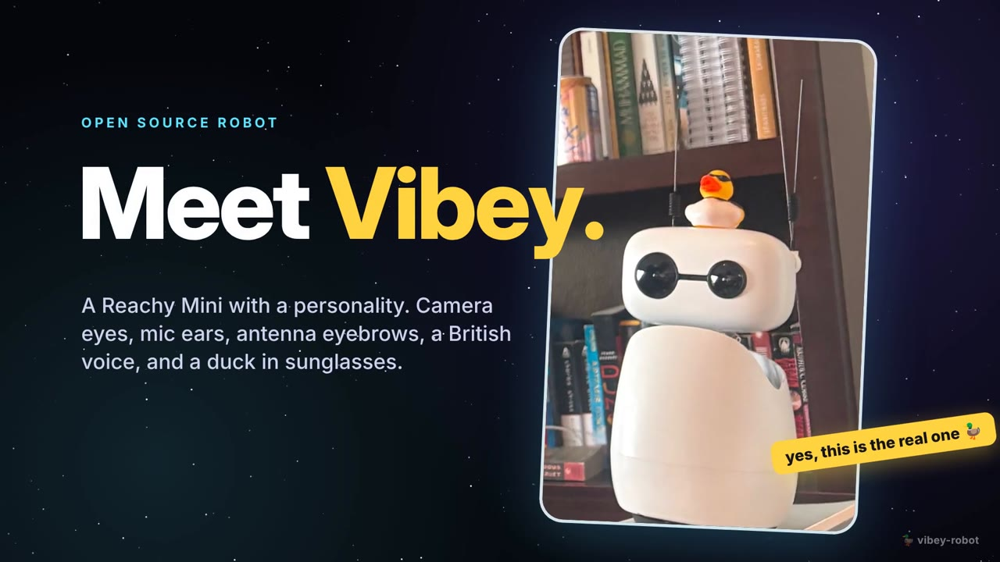

# Vibey 🤖

Vibey is a physical [Reachy Mini](https://www.pollen-robotics.com/) robot with a
personality: camera eyes, mic ears, antenna eyebrows, a British-robot voice, face
memory, games, and — unusually — write access to its own source code.

▶️ **[Watch the demo (47s)](https://github.com/jackmielke/vibey-robot/raw/main/docs/demo/vibey-demo.mp4)**: the whole thing in one reel.

Four ways in:

- 💬 **Text it on Telegram.** It's a bot too: ask what it can see, get a photo
  back, tell it something to remember (`reachy_telegram.py`).
- 📱 **An iPhone app.** Wake it, drive it, make it talk, DJ, browse its memory
  (`ios/Vibey`, SwiftUI).
- 💻 **A Mac app.** Menu bar status item plus the full live dashboard
  (`mac/`), or just type `./vibey`.
- 🛠 **Program it to do anything.** Every service is a small readable Python
  file. Clone the repo, add a skill, and the robot does it.

The reel itself is code: an animated page (`docs/demo/demo.html`), a
synthesized soundtrack (`docs/demo/soundtrack.py`), and
`node docs/demo/render.mjs` to re-render it.

This repo is the whole robot: its eyes, voice, memory, body language, dashboard,
and the voice "brains" it can think with. It was split out of the
[`handsfree`](https://github.com/jackmielke/handsfree) gesture-OS repo, where it
started life; the only remaining tie is an optional gesture bridge that reads
handsfree's motion stream over HTTP (see `reachy_bridge.py`).

## The services

Each is a small standalone program that talks to the others over HTTP on a fixed
port. Boot them all with `./start_wonder.sh` (shell-launched — the chat mic needs
a real terminal's mic permission).

| Port | Service | What it does |
|------|---------|--------------|
| 8770 | `reachy_viewer.py`   | **Dashboard** — camera, chat, face gallery, controls |
| 8771 | `reachy_camera.py`   | Robot camera → MJPEG bridge (SDK venv) |
| 8772 | `reachy_chat.py`     | **The mind** — hears, thinks, speaks; picks the voice brain |
| 8773 | `reachy_memory.py`   | Face recognition + greetings + journal (SDK venv) |
| 8774 | `reachy_vibeverse.py`| Vibey's avatar in the VibeVerse 3D world |
| 8775 | `reachy_robot_mic.py`| Robot's mic → PCM stream, and replies streamed to its speaker (SDK venv) |
| 8776 | `reachy_gestures.py` | Hand gestures from the camera → body (`.venv-gestures`) |
| 8778 | `reachy_dj.py`       | DJ mode: local tracks, live tempo, bobs to the beat |
| —    | `reachy_telegram.py` | Text Vibey from anywhere |
| —    | `reachy_alarm.py`    | Wake-up shows (7am song + dance) |
| —    | `reachy_watchdog.py` | Restarts any dead service, pings Telegram |
| —    | `reachy_bridge.py`   | Optional: handsfree gestures → robot body (`BRIDGE=1`) |

Supporting modules: `reachy_voice.py` (ElevenLabs TTS), `reachy_emotes.py`
(synthesized chirps + dances), `reachy_sfx.py` (sci-fi soundboard),
`reachy_vibe.py` (the `vibe_check` voice tool — scores the *conversation* 1-100
with an uncertainty band; sensitive-topic and health inference are filtered in
code, and saving to Supabase needs both `VIBE_LOG=1` and a spoken yes. Its
docstring has the schema and the privacy notes).

## The voice brains

Pick one from the iOS app's Brain pop-up (tap the brain pill on Home), the
dashboard, or `/brain` on Telegram:

- **Basic** — Realtime 2.1 with nothing extra: no tools, memory or nudges. Just
  talks, and can look through the camera.
- **Realtime 2.1** — one OpenAI model hears, thinks and speaks, with every tool
  (body, camera, DJ, Spotify, memory, coding jobs).
- **GPT-Live 1** — OpenAI's voice layer in front of a gpt-5.5 backend.
- **Local** — everything on the Mac, nothing in the cloud: faster-whisper →
  Ollama (`qwen3:4b-instruct`) → Piper voice. Free, private, works offline
  (`reachy_local.py`; needs `ollama pull qwen3:4b-instruct` and the Piper voice
  in `models/piper/`).

Replies stream to the speaker as they arrive. Every session is told the time of
day. Texts sent while Vibey is awake join the same conversation: answered by
text, and said out loud only if Vibey decides the room should hear it
(`say_aloud`).

## Day-to-day

- **Stages** — 1 robot alone · 2 + Mac (no cloud, no spend) · 3 + cloud.
- **Camera switch** — `/camera off` (or the app) closes the video session, which
  also frees the robot's CPU and smooths its motion.
- **Budget** — crossing `VIBEY_DAILY_BUDGET` sends a loud Telegram warning and
  keeps running (`VIBEY_BUDGET_HARD=1` restores sleep-and-refuse). Tap the
  "$ today" pill in the app for the breakdown.
- **Asleep is idle** — face memory and gestures pause while Vibey sleeps, and the
  wake listener throttles itself when a TV is talking.
- **Spotify** — Vibey drives the Mac's Spotify app; searching by name needs
  `SPOTIFY_CLIENT_ID`/`SPOTIFY_CLIENT_SECRET`.
- **iOS app** — `ios/Vibey` (`./build.sh` installs on a paired iPhone): live
  camera, chat, soundboard, friend profiles, controls, spend.

## Setup

Two Python environments (both git-ignored):

- **`reachy_env`** — the Reachy Mini SDK venv (camera, mic, face recognition).
  Needs `reachy_mini`, `face_recognition` (via `dlib-bin`), GStreamer. This is
  the heavy one.
- **`.venv`** — a lean venv for the chat service: `faster-whisper`,
  `sounddevice`, `numpy`, `websockets`.

Copy `.env.example` to `.env` and fill in your keys, then `./start_wonder.sh`.

## Identity

Vibey's personality and self-knowledge live in the markdown files it can edit
itself: `IDENTITY.md`, `SOUL.md`, `USER.md`, `TOOLS.md`, `AGENTS.md`,
`HEARTBEAT.md`. `OVERNIGHT.md` is its build diary.
